# AWS Deployment

This document presents the end-to-end deployment of the **Repair Shop Application** on AWS, covering database setup, backend deployment, application configuration, frontend hosting, and full-stack validation.

The deployment was approached from a **Cloud Support perspective**, with each major infrastructure layer validated before moving to the next.

---

## Architecture

```text
                         AWS Cloud
─────────────────────────────────────────────────────────────
                                                             
   Amazon S3                                                 
   React Frontend                                            
        │                                                    
        │ HTTP API Request                                   
        V                                                    
   Backend Application                                       
   Node.js + Express                                         
        │                                                    
        │ Private VPC Connectivity                           
        V                                                   
   Amazon RDS                                                
   MySQL Database                                           
                                                             
─────────────────────────────────────────────────────────────
```

### AWS Services Used

Component          |   AWS Service      |   Purpose

 Frontend           -   Amazon S3        -   Hosts the production React application    
 Backend            -   Amazon EC2       -   Runs the Node.js / Express API            
 Database           -   Amazon RDS MySQL -   Stores repair requests                    
 Networking         -   Amazon VPC       -   Provides private network communication    
 Access Control     -   Security Groups  -   Controls application and database traffic 
 Service Management -   Linux systemd    -   Keeps the backend service running         

---

# Deployment Process

## 1. RDS Database

The MySQL database was created in Amazon RDS to provide the persistent data layer for repair requests.

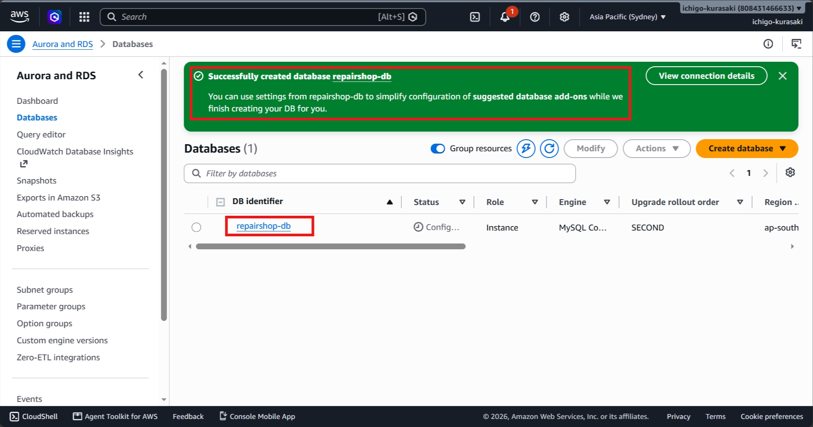

 Provisioned the managed RDS MySQL database required for persistent storage of application repair requests.

---

## 2. Backend Deployment

The backend API was deployed to the AWS application environment and made available for application requests.

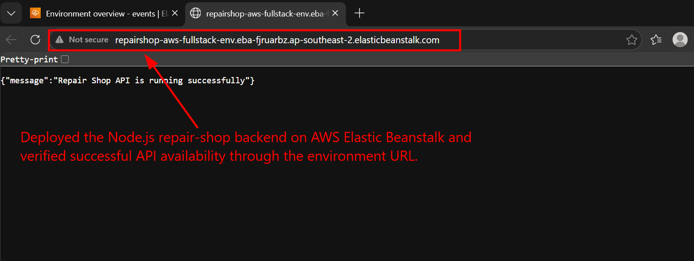

 Deployed the backend application to AWS and established the application layer required to process repair requests.

---

## 3. Backend Environment Configuration

Environment-specific configuration was added to connect the backend application with the RDS database without hard-coding credentials into the application source.

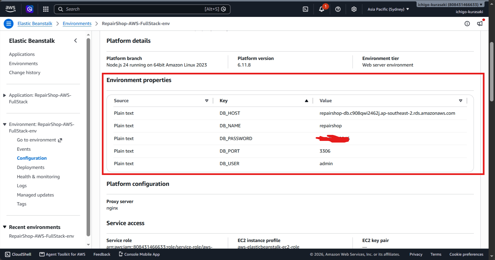

Configured environment-specific database settings while keeping sensitive application credentials separate from source code.

---

## 4. Backend Health Validation

The backend health endpoint was tested after deployment to confirm that the application was running correctly.

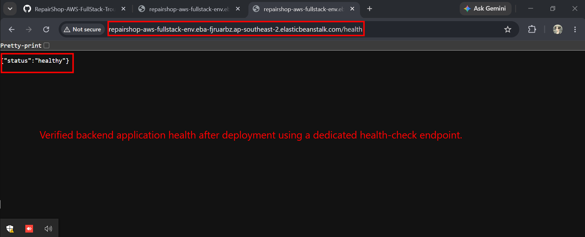

 Performed an application health check to confirm that the deployed backend was operational before proceeding with further validation.

---

## 5. Frontend Application Validation

The React frontend was tested by creating a repair request and confirming that the application could process the user input.

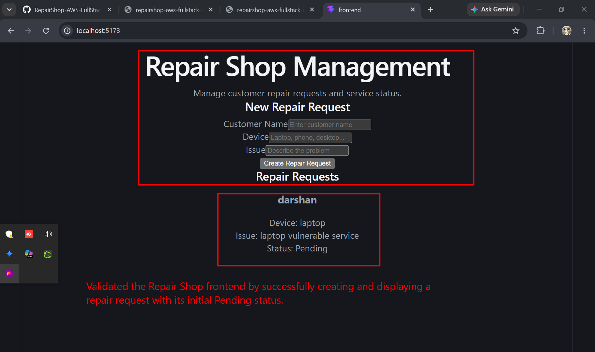

 Validated the frontend workflow by successfully creating a repair request through the application interface.

---

# Backend Infrastructure & Connectivity

The following deployment evidence documents the backend infrastructure and private database connectivity used in the final AWS architecture.

## 6. Backend Deployment Package

A clean production deployment package was prepared containing the backend application and required dependency definitions.

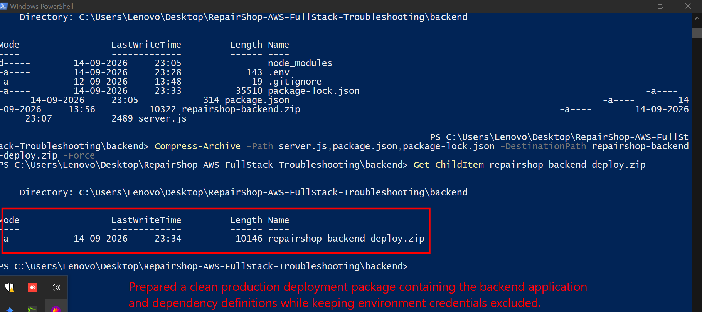

 Prepared a clean deployment package while keeping environment credentials and sensitive configuration outside the application package.

---

## 7. EC2 Backend Server

An Amazon EC2 instance was provisioned to host the Node.js backend application.

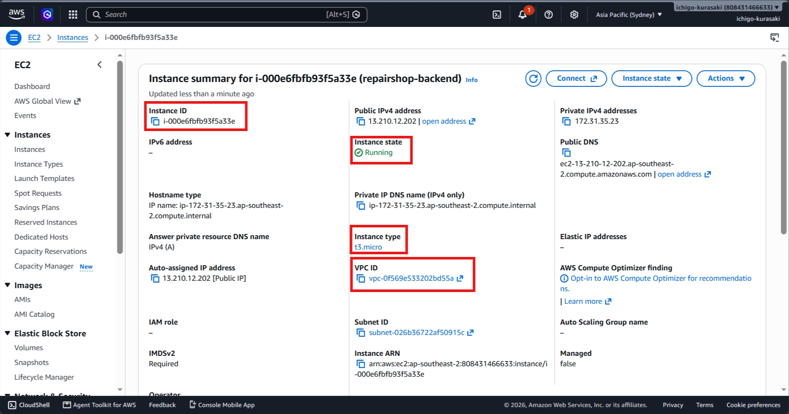

 Provisioned an EC2 application server to host the backend and provide controlled connectivity to the private database layer.

---

## 8. Node.js Runtime

The Node.js runtime required by the backend was installed and validated on the EC2 server.

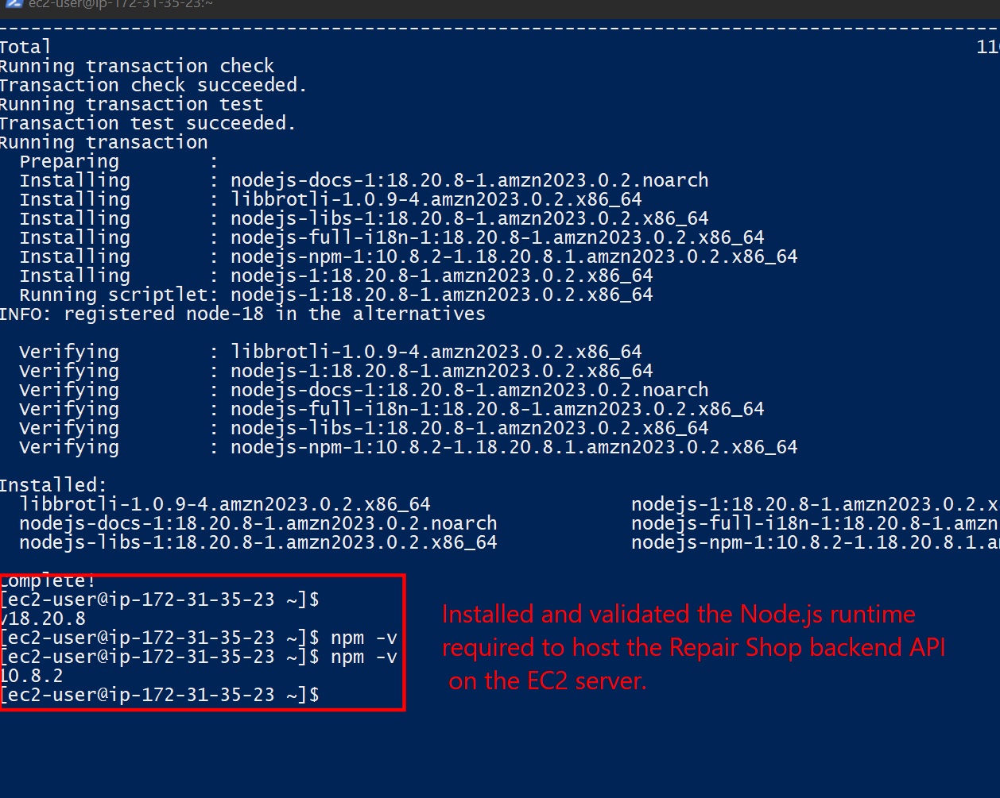

Installed and validated the application runtime required to execute the Node.js backend on the server.

---

## 9. RDS Security Group

Database access was restricted through the RDS security group so that MySQL traffic could be accepted from the backend EC2 security group rather than being publicly exposed.

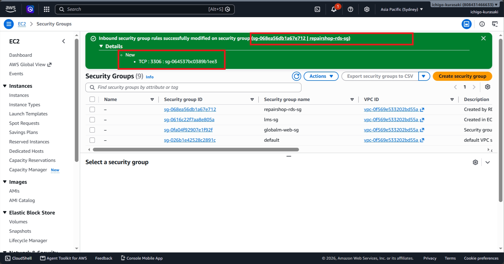

 Applied network-level access control to restrict database connectivity to the authorized backend server.

---

## 10. EC2-to-RDS Connectivity

Private connectivity between the backend EC2 instance and RDS MySQL was verified before application-level database testing.

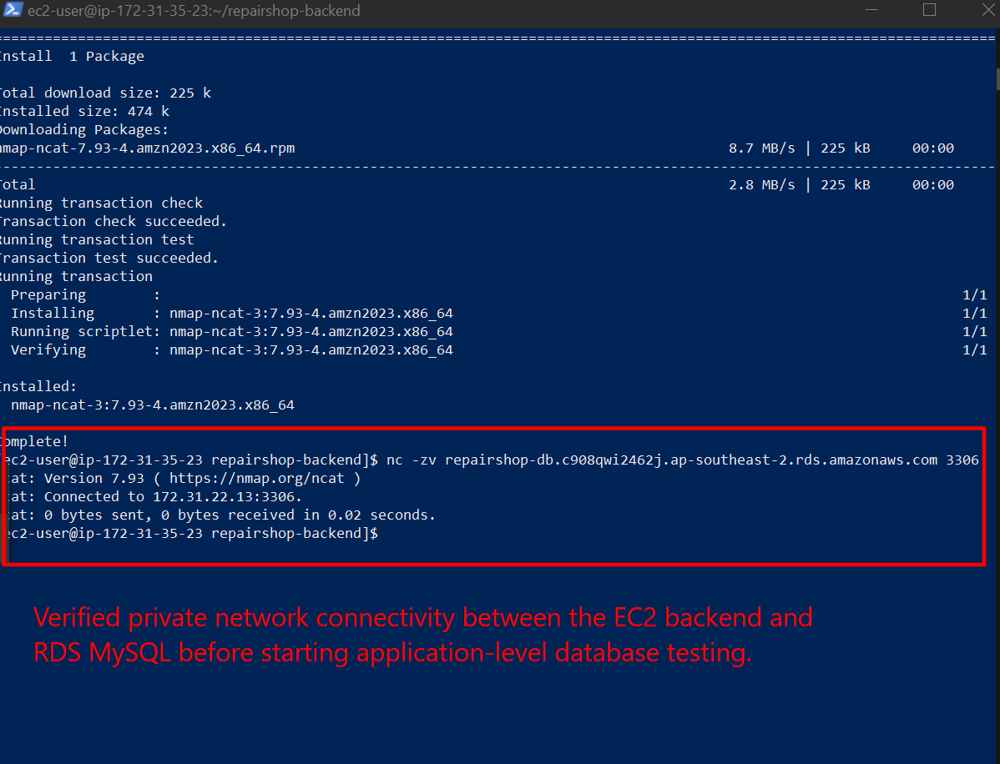

  Verified private backend-to-database connectivity to isolate network issues before validating application functionality.

---

## 11. End-to-End Backend API

The deployed API was tested by submitting a repair request and confirming successful communication with the database.

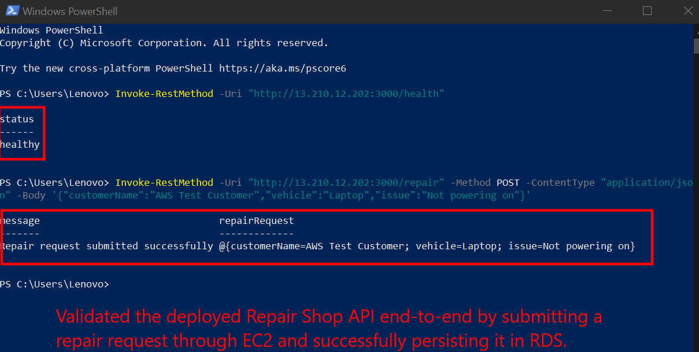

 Validated the backend end-to-end by submitting a repair request and confirming successful database persistence.

---

# Frontend Deployment

## 12. Production Build

The React frontend was converted into a production-ready build for AWS hosting.

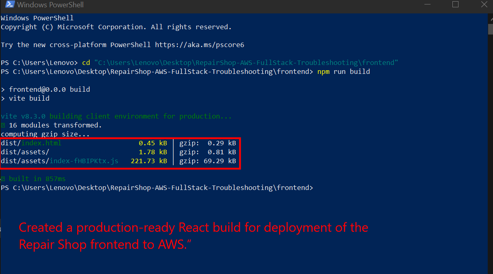

 Generated the production frontend build required for deployment and hosting on AWS.

---

## 13. Frontend Files Uploaded to S3

The production React build artifacts were uploaded to the Amazon S3 frontend hosting bucket.

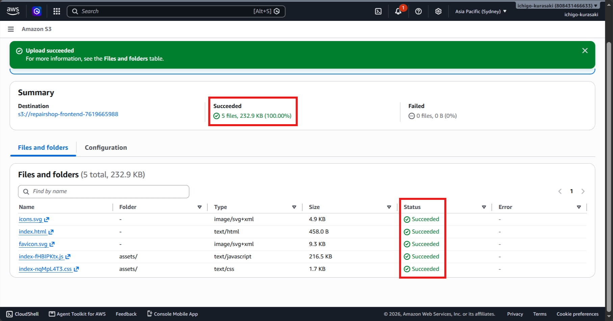

 Deployed the production frontend artifacts to Amazon S3 as the application's web hosting layer.

---

## 14. AWS-Hosted Frontend

The React application was successfully served through Amazon S3 static website hosting.

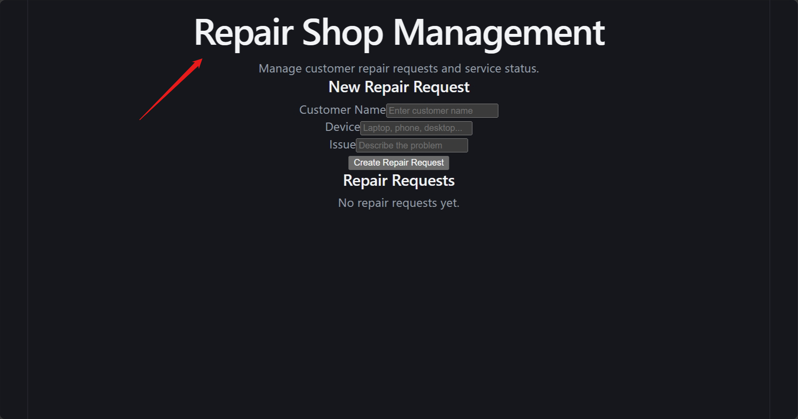

  Verified that the production frontend was accessible through AWS static website hosting.

---

## 15. Full-Stack Deployment Validation

The final application workflow was tested from the AWS-hosted frontend through the backend API and into the RDS database.

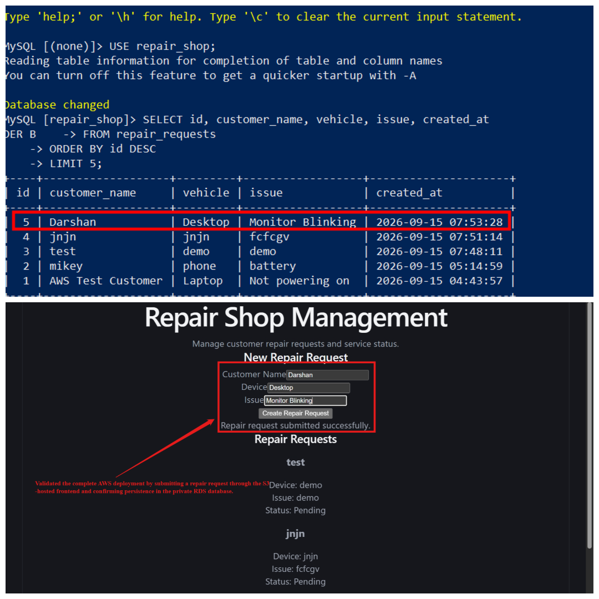

  Validated the complete production workflow from frontend request through backend processing to database persistence.

---

# Deployment Validation

The final deployment was validated across each major layer:

| Layer      | Validation                                            

 Frontend   -   React application successfully hosted on S3           
 Backend    -   Node.js / Express API successfully deployed           
 API        -   Health check and repair request endpoints validated   
 Network    -   EC2-to-RDS private connectivity verified              
 Database   -   Repair requests successfully persisted in RDS         
 Security   -   Database access restricted through Security Groups    
 Full Stack -   Frontend → Backend → RDS workflow successfully tested 

---

# Support Perspective

This deployment was structured so that each layer could be independently checked when an issue occurs.

### Application Layer

* API health checks
* Request validation
* Application service status
* Backend logs

### Server Layer

* EC2 instance availability
* Node.js runtime
* Linux service management
* Process and port validation

### Network Layer

* Security Group rules
* EC2-to-RDS connectivity
* Backend API accessibility

### Database Layer

* RDS availability
* MySQL connectivity
* Database configuration
* Data persistence

### Frontend Layer

* Production build
* S3 hosting
* Frontend accessibility
* Frontend-to-backend communication

This layered deployment provides a realistic foundation for diagnosing issues by narrowing failures down to the **frontend, application, server, network, or database layer**.


