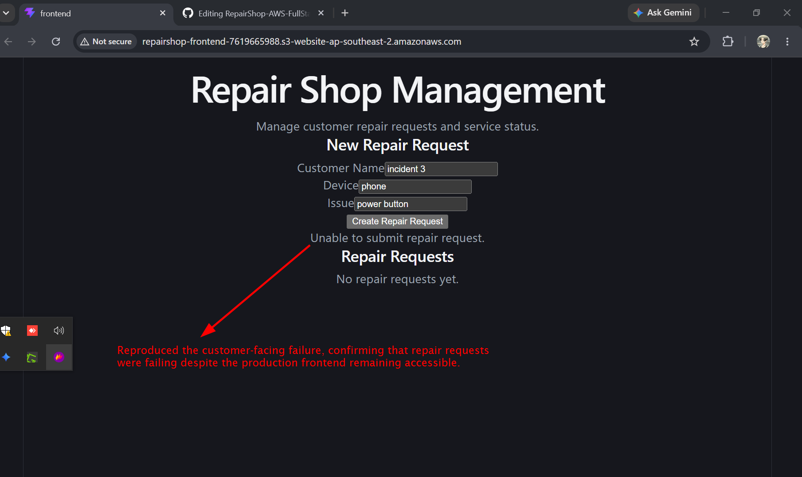

# Incident 03 – API 500 Due to Invalid Database Configuration

## Incident Summary

A customer was unable to submit a repair request because the backend API returned an **HTTP 500 Internal Server Error** while processing the database operation.

The backend service itself was running normally, but the application was configured to use an incorrect database name.

This incident demonstrates a practical Cloud Support workflow: **identify customer impact -> isolate the failing layer -> verify service status -> investigate application logs -> identify root cause -> restore configuration -> validate recovery.**

---

## Incident Flow

**Customer Impact -> API Investigation -> Service Investigation -> Application Log Investigation -> Root Cause -> Remediation -> Recovery**

### 1. Customer Impact

The production frontend was available, but submitting a repair request failed.

> Reproduced the customer-facing failure, confirming that repair requests were failing despite the production frontend remaining accessible.

---

### 2. API Investigation

The backend API remained reachable, but the database-dependent repair request returned an HTTP 500 error.

[API 500 error](02-api-500-error.png)

> Confirmed that the backend API was reachable but returned an HTTP 500 error when processing a database-backed repair request.

---

### 3. Backend Service Investigation

The EC2 backend service was checked to determine whether the failure was caused by the application service being stopped.

[Backend service running](03-backend-service-running.png)

> Confirmed the backend service remained operational, narrowing the issue from service availability to an application-level database configuration issue.

---

### 4. Application Log Investigation

The backend application logs were reviewed to identify the reason for the HTTP 500 response.

[Application error logs](04-application-error-logs.png)

> Reviewed application logs and identified an invalid database configuration as the root cause of the API failures.

---

## Root Cause

**Incorrect database configuration -> backend attempted to connect to `repair_shop_test` -> database operation failed -> API returned HTTP 500 -> customer repair request failed.**

---

### 5. Remediation

The incorrect database configuration was restored to the production database name and the backend service was restarted.

[Database configuration restored](05-database-configuration-restored.png)

> Restored the correct production database configuration and restarted the backend service to apply the remediation.

---

### 6. API Recovery

A database-backed repair request was successfully processed after restoring the correct database configuration.

[API recovery](06-api-recovery.png)

> Confirmed API recovery by successfully processing a database-backed repair request after restoring the correct application configuration.

---

### 7. Customer Recovery

The production frontend was tested again and the repair request was successfully submitted.

[Repair request recovered](07-repair-request-recovered.png)

> Completed end-to-end recovery validation by successfully submitting a repair request through the production frontend after restoring the correct application configuration.

---

## Support Skills Demonstrated

* Customer-impact identification
* API troubleshooting
* Linux service investigation
* Application log analysis
* Environment variable troubleshooting
* Database configuration troubleshooting
* Application-layer isolation
* Root-cause identification
* Targeted configuration remediation
* End-to-end recovery validation
* Incident documentation

## Incident Outcome

The incorrect database configuration was corrected without changing the application code.

The complete application flow returned to normal:

**Customer -> S3 Frontend -> EC2 Backend -> RDS MySQL**

