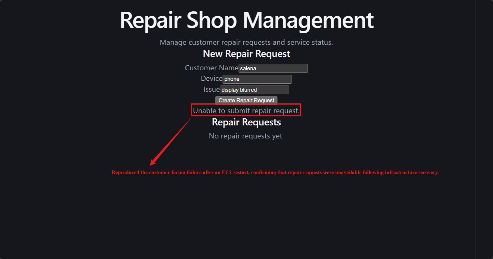
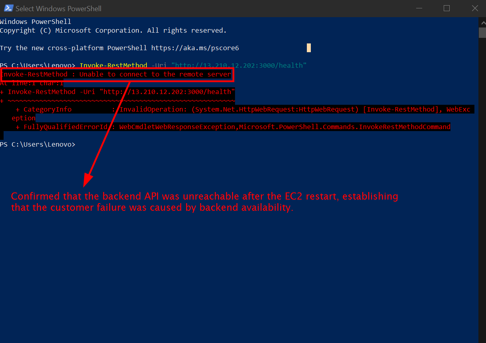
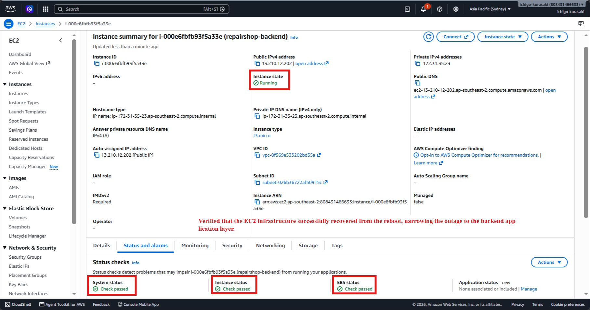
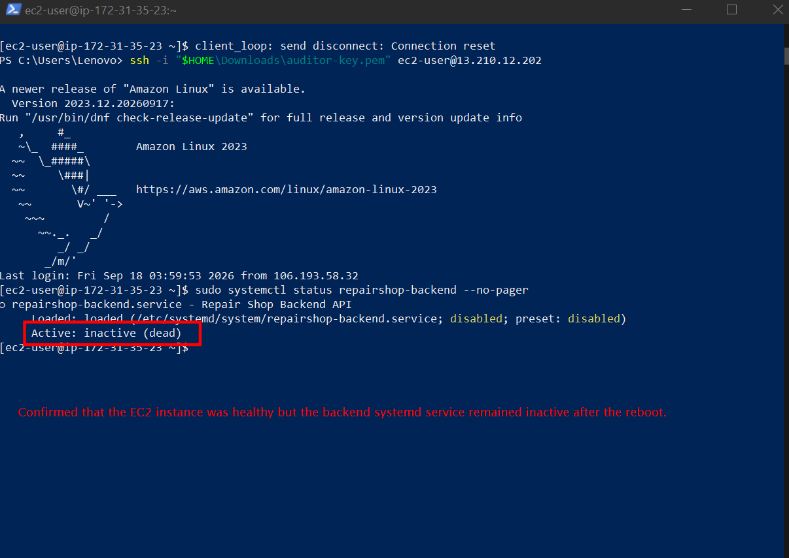
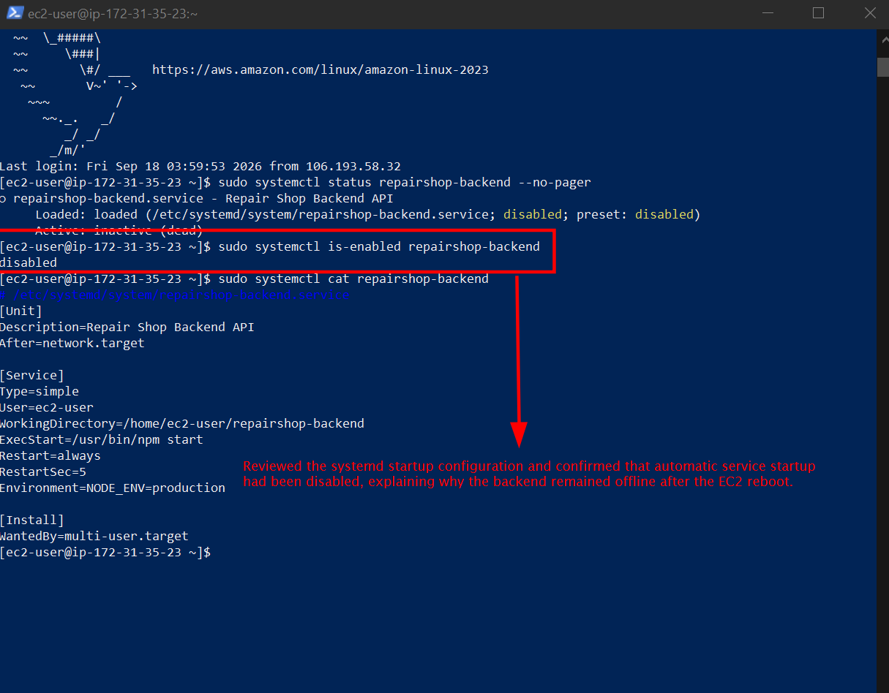
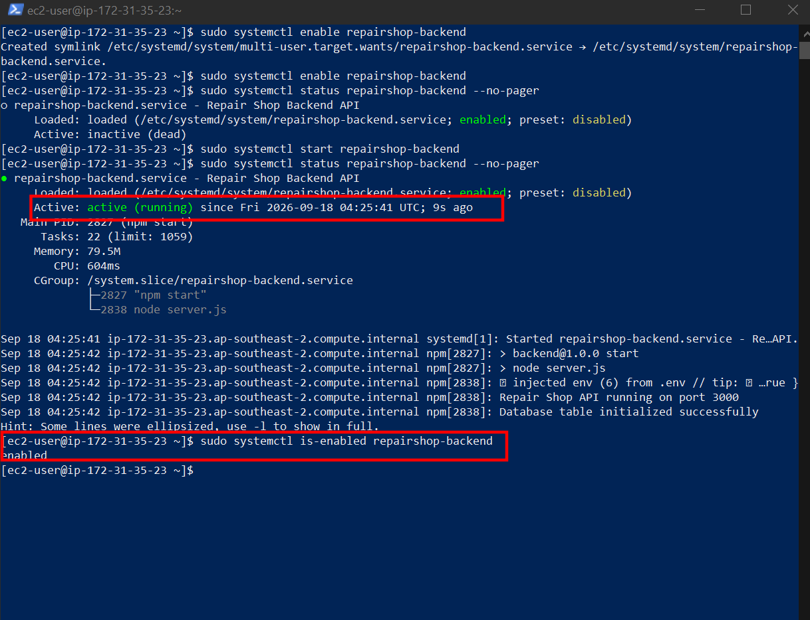
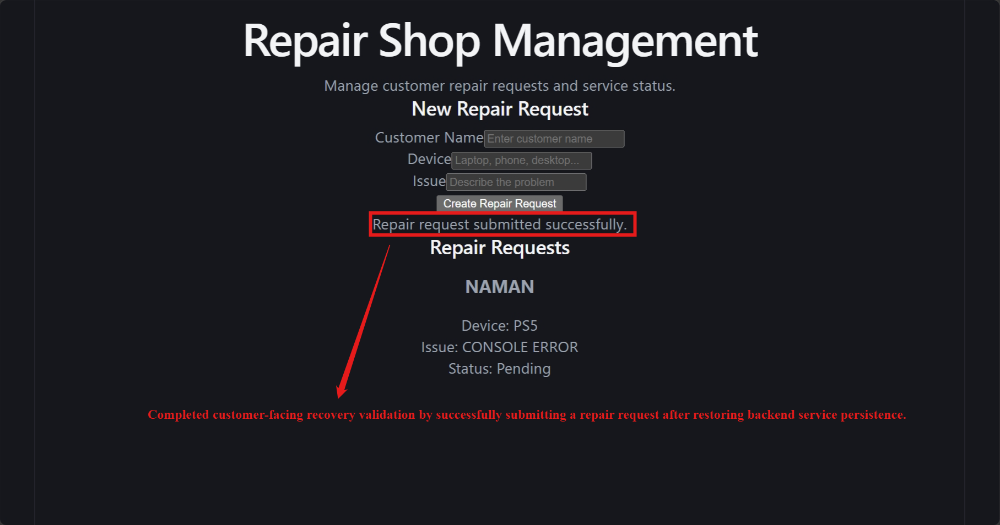

# Incident 05 – Backend Service Fails After EC2 Reboot

## Incident Summary

A customer was unable to submit a repair request after the backend EC2 instance was restarted.

The EC2 instance successfully recovered and returned to a healthy running state, but the Node.js backend service did not start automatically.

The investigation identified that the backend systemd service had been configured without automatic startup after a previous configuration change.

This incident demonstrates a practical Cloud Support workflow: **identify customer impact -> verify API availability -> check infrastructure health -> inspect service status -> investigate startup configuration -> restore service persistence -> validate recovery.**

---

## Incident Flow

**Customer Impact -> API Investigation -> EC2 Investigation -> Service Investigation -> Root Cause -> Remediation -> Recovery**

### 1. Customer Impact

The production frontend remained accessible, but submitting a repair request failed after the EC2 instance restart.

**Evidence:** `01-repair-request-failure.png`

> Confirmed that the customer workflow was unavailable following the backend server restart.

---

### 2. API Investigation

The backend health endpoint was tested from the client side to determine whether the API was responding.

> Established that the backend endpoint was no longer responding, indicating an availability issue behind the production frontend.

---

### 3. EC2 Infrastructure Investigation

The EC2 instance was checked in the AWS Console after the reboot.

> Verified that the underlying EC2 infrastructure had recovered successfully, shifting the investigation toward the application service.

---

### 4. Backend Service Investigation

The backend systemd service was inspected after reconnecting to the EC2 instance.

> Found that the application process was inactive even though the EC2 instance itself was operating normally.

---

## Root Cause

**Automatic service startup was disabled → EC2 reboot completed → backend service did not start → API became unavailable → customer repair requests failed.**

---

### 5. Startup Configuration Investigation

The systemd configuration was reviewed to determine why the backend had not started during system boot.

> Confirmed that the backend service was configured as disabled, explaining why it did not automatically return after the EC2 restart.

---

### 6. Remediation

Automatic startup was restored and the backend service was started successfully.

> Re-enabled the backend service for automatic startup and returned the application process to an operational state.

---

### 7. Customer Recovery

The production frontend was tested after restoring the backend service.

> Verified that customers could successfully complete the repair request workflow after backend service recovery.

---

## Skills Demonstrated

* Customer-impact identification
* API availability troubleshooting
* EC2 infrastructure verification
* Linux/systemd troubleshooting
* Service startup investigation
* Infrastructure recovery analysis
* Root-cause identification
* Service persistence configuration
* Application recovery validation
* End-to-end customer validation
* Incident documentation

## AWS Components Involved
      
* Amazon S3        
* Amazon EC2       
* Amazon RDS MySQL 
* systemd          
* Security Groups  

## Incident Outcome

The backend service was restored and configured to start automatically during future EC2 system boots.

The complete application flow returned to normal:

**Customer -> S3 Frontend -> EC2 Backend -> RDS MySQL**

